# 游戏手册

具体名词解释可以点击自动跳转

任何疑问咨询QQ:646167331

# 目录

## [角色](#角色)

* ## [狼人阵营](#狼人阵营)

  | [狼人](#狼人)                   | [狼王](#狼王)     | [白狼王](#白狼王) | [恶灵骑士](#恶灵骑士) |
  | ------------------------------- | :---------------- | ----------------- | --------------------- |
  | [狼美人](#狼美人)               | [石像鬼](#石像鬼) | [隐狼](#隐狼)     | [血月使徒](#血月使徒) |
  | [噩梦之影*梦魇](#噩梦之影*梦魇) | [狼兄](#狼兄)     | [狼弟](#狼弟)     | [种狼](#种狼)         |
  | [火狼](#火狼)                   | [恶魔](#恶魔)     |                   |                       |

* ## [好人阵营](#好人阵营)

  | [平民](#平民)         | [炸弹人](#炸弹人)     | [预言家](#预言家) | [女巫](#女巫)               |
  | --------------------- | --------------------- | ----------------- | --------------------------- |
  | [猎人](#猎人)         | [白痴](#白痴)         | [守卫](#守卫)     | [摄梦人*名媛](#摄梦人*名媛) |
  | [魔术师](#魔术师)     | [骑士](#骑士)         | [守墓人](#守墓人) | [乌鸦](#乌鸦)               |
  | [猎魔人](#猎魔人)     | [黑市商人](#黑市商人) | [狐狸](#狐狸)     | [锈剑骑士](#锈剑骑士)       |
  | [禁言长老](#禁言长老) | [老流氓](#老流氓)     | [寻熊师](#寻熊师) | [潜行者](#潜行者)           |

* ## [第三方阵营](#第三方阵营)

  | [丘比特](#丘比特)     | [盗贼](#盗贼)     | [咒狐](#咒狐) | [暗恋者](#暗恋者) |
  | --------------------- | ----------------- | ------------- | ----------------- |
  | [鬼魂新娘](#鬼魂新娘) | [野孩子](#野孩子) |               |                   |

## [板子](#板子)

[12人预女猎白](#12人预女猎白)

[12人暗恋者](#12人暗恋者 )

[12人白狼王骑士](#12人白狼王骑士)

[12人白狼王守卫](#12人白狼王守卫)

[12人恶灵骑士](#12人恶灵骑士)

[12人噩梦之影](#12人噩梦之影)

[12人鬼魂新娘](#12人鬼魂新娘)

[12人黑市商人狼兄狼弟](#12人黑市商人狼兄狼弟)

[12人狼美人骑士](#12人狼美人骑士)

[12人狼王狐女猎守](#12人狼王狐女猎守)

[12人狼王魔术师](#12人狼王魔术师)

[12人狼王摄梦人](#12人狼王摄梦人)

[12人狼王守卫](#12人狼王守卫)

[12人丘比特](#12人丘比特)

[12人石像鬼守墓人](#12人石像鬼守墓人)

[12人咒狐乌鸦](#12人咒狐乌鸦)

[12人血月猎魔人](#12人血月猎魔人)

[12人禁言潜行](#12人禁言潜行)

[12人禁言骑士](#[12人禁言骑士)

[12人恶魔守卫](#12人恶魔守卫)

[12人噩梦之影(梦魇)守卫](#12人噩梦之影(梦魇)守卫)

[12人狼美人老流氓](#12人狼美人老流氓)

## [术语](#术语)

| [金水](#金水)     | [银水](#银水)     | [铜水](#铜水)     | [查杀](#查杀)         |
| ----------------- | ----------------- | ----------------- | --------------------- |
| [对跳](#对跳)     | [悍跳](#悍跳)     | [悍跳狼](#悍跳狼) | [站边](#站边)         |
| [聊爆](#聊爆)     | [铁狼](#铁狼)     | [自爆](#自爆)     | [踩](#踩)             |
| [表水](#表水)     | [蛋牌](#蛋牌)     | [枪牌](#枪牌)     | [划水](#划水)         |
| [归票](#归票)     | [冲票](#冲票)     | [压手](#压手)     | [抗推](#抗推)         |
| [空守](#空守)     | [自守](#自守)     | [上警](#上警)     | [警上](#警上)         |
| [警下](#警下)     | [警徽流](#警徽流) | [平安夜](#平安夜) | [孤狼宣言](#孤狼宣言) |
| [撕警徽](#撕警徽) | [吞警徽](#吞警徽) | [退水](#退水)     | [反水](#反水)         |
| [冲锋狼](#冲锋狼) | [倒钩狼](#倒钩狼) | [怂狼局](#怂狼局) | [身份作好](#身份作好) |
| [诈身份](#诈身份) | [诈身份](#诈身份) | [积身份](#积身份) | [穿衣服](#穿衣服)     |
| [递话](#递话)     | [挡刀](#挡刀)     | [自刀](#自刀)     | [贴脸](#贴脸)         |
| [丢水包](#丢水包) | [PK](#PK)         | [盲毒](#盲毒)     | [睡](#睡)             |
| [连](#连)         | [链子](#链子)     | [好人链](#好人链) | [狼狼链](#狼狼链)     |
| [人狼链](#人狼链) | [埋](#埋)         |              |                  |

# 角色

## 狼人阵营

### 狼人

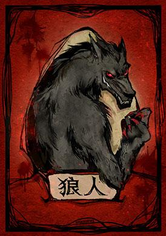

##### 能力

每晚可以袭击-名玩家。

##### Q/A

[Q]狼人自爆到底是干嘛用的?
[A]狼人自爆能够立刻打断当前玩家正在进行的发言，跳过所有今天白天接下来的剩余流程，公布出局讯息后立刻进入天黑。如果是在警长竞选阶段自爆，则会导致本局游戏没有警长。这种骚操作被称作“吞警徽”。(注:以上为非“双爆”规则，关于吞警徽详细内容请查阅“手册流程上警流程”)

[Q]只有狼人可以自爆吗?
[A]所有狼人阵营的角色都可以自爆，包括狼人、狼王和白狼王。

[Q]首夜吃了毒的狼人警长竞选时也可以自爆吗?
[A]可以，但自爆后不会直接天黑，而是会进入白天放逐发言阶段。
(注:以上为非“双爆”规则)

[Q]狼人都能在什么时候自爆?
[A]警上发言阶段和白天放逐发言阶段(包括平票PK产生的发言阶
段)，以及采用“双爆吞警徽”规则中的退水阶段。

[Q]“双爆吞警徽” 规则是怎么回事?
[A]采用了“双爆吞警徽”规则(简称“双爆”规则)的模式中，在警长竞选阶段自爆不会导致警徽流失，而是保存警上竞选状态的情况下直接进入天黑(即便自爆的是吃毒狼人也是如此，这又被称作吞毒”)，夜晚正常行动后，第二天白天直接进入退水环节，在此阶段若再有狼人玩家自爆则警徽流失然后进入天黑(同样可以“吞毒”);若无人自爆则退水环节结束后进入警.上投票环节，若产生平票后，平票玩家轮流发然后再做一-轮投西示，发言时若再有很人玩家自爆则警徽流失然后进入天黑(同样可以“吞毒”)。

[Q]狼人在夜间决定袭击目标的时候意见不统一怎么办?[A]在大部分模式中，所有狼人弃刀则空刀，出刀狼人意见不统一时按多数意见处理，刀数相同时从刀数相同的目标中随机选择一个成为袭击目标。在丘比特存在的模式中，出刀狼人意见不统一时则空刀，即出刀狼人必须统一意见才能成功
袭击目标玩家。

### 狼王

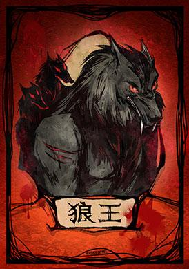

#### 能力

出局后可以选择一名玩家，使TA一并出局。

#### Q/A

[Q]狼王自爆后可以发动技能吗?
[A]不能，只有夜间中刀或白天被放逐时可以发动技能。被女巫毒出局也无法发动技能。

### 白狼王

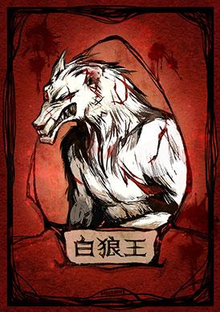

#### 能力

自爆时可以选择一名玩家， 使其一并出局。

#### Q/A

[Q]白狼王自爆后有遗言吗?
[A]若发动技能则会公开自己的身份牌，这种情况下没有，被自己
带走的目标玩家以及相关的更多玩家也没有。若不发动技能则在非狼人玩家视角中是作为普通狼人出局的，这种情况下有遗言。 

[Q]双爆吞警徽的情况下，被毒的白狼王自爆会怎么样?
[A]自爆后无法发动技能，接下来公布出局讯息后天黑。

[Q]双爆吞警徽的情况下，白狼王和另外一个玩家上警，并且自爆
发动技能击败了另一个玩家，流程是怎么样的?
[A]公布警徽流失，公布昨夜出局讯息，然后天黑。

[Q]吃毒白狼王警上自爆能否发动技能?
[A]不能，因此这种情况下，在非狼人玩家视角中无法分辨该角色
是白狼王还是普通狼人。

### 恶灵骑士

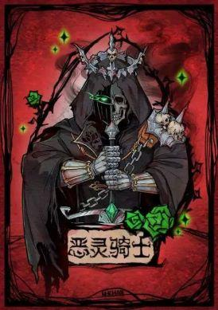

#### 能力

狼人阵营，无法自爆，且免疫夜间伤害。拥有一次性的反伤技能:若被预言家查验，次日预言家出局;若被女巫使用毒药，次日女巫出局。

#### Q/A

[Q]“无法在夜间出局” 是什么意思?
[A]被女巫使用了毒药也不会出局，且无法成为狼人夜间袭击的目
标。

[Q]技能是一次性的这是什么意思?

[A]举例说明，假如第一夜被预言家查验，天亮后预言家会出局，但第二夜被女巫撒毒后，天亮后女巫就不会出局了。不过因为无法在夜间出局的效果是永久的，因此恶灵骑士也不会出局。

[Q]如果在同一晚中同时被预言家查验、女巫开毒，怎么结算?
[A]第二天预言家会出局，女巫不会。

[Q]法官会告诉我我的技能是否已经发动了吗?
[A]不会，需要玩家根据昨夜出局玩家信息自行分析。

[Q]女巫能救活中了恶灵骑士反伤技能的预言家吗?
[A]不能，女巫只能救活被狼人袭击的目标，查验了恶灵骑士的预言家在成为狼人袭击目标的情况下，女巫虽然可以使用解药但也救不活，预言家还是会出局。类似的守卫的守护也对恶灵骑士的反伤无效。

### 狼美人

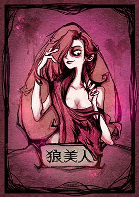

#### 能力

每晚参与袭击后，可单独睁眼并魅惑一名玩家。狼美人出局时，昨夜被魅惑的玩家随之殉情出局。

#### Q/A

[Q]魅惑技能发动在白天和发动在夜晚是不是效果不一样?
[A]是的，当狼美人在夜晚出局时(被毒)，第二天公布出局会一同公布殉情者的出局讯息，但不会公布谁是殉情者，需要玩家自行分析出局原因，按正常多人出局的流程处理。当狼美人在白天出局时(被放逐)，狼美人会翻牌，并公布殉情者是谁，并在狼美人之后执行遗言和移交警徽等步骤。当狼美人因骑士决斗出局时技能无法发动，因此也不会翻牌，魅惑目标也不会出局。
[Q]你是说狼美人被毒杀的时候被魅惑的目标第二天公布出局讯息时还是会出局?
[A]没错。

### 石像鬼

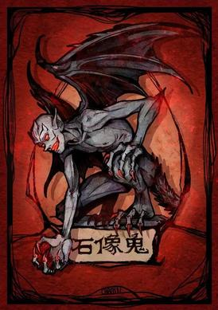

#### 能力

狼人阵营，不能自爆，夜间无法与狼人讨论、无法参与袭击、也无法与其他狼人互知身份。每晚可以查验一名玩家的具体身份。当其他所有狼人出局后，可在夜间进行袭击。

#### Q/A

Q:石像鬼被预言家查验显示的是狼人吗?
A:是的，被预言家查验始终显示为狼人。

Q:那么石像鬼能否自爆?
A:不能自爆。

Q:石像鬼能否查验自己或重复查验某名玩家的身份?
A:不可以。

Q:石像鬼能否看到其他狼队友?
A:石像鬼不能看到狼队友身份。

### 隐狼

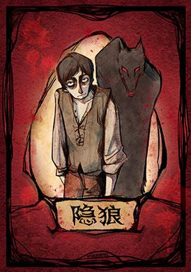

#### 能力

狼人阵营，不能自爆，夜间无法参与袭击，被预言家查验结果始终为好人。隐狼夜间知道其他哪些玩家是狼人。当其他所有狼人出局后，可在夜间进行袭击。

#### Q/A

Q:隐狼能否自爆?
.A: 不能自爆

Q:狼人和隐狼能否看到彼此的身份?
.A: 隐狼可以看到狼人队友的身份，但不知道具体是什么狼人。狼人队友不能看到隐狼的身份。

### 血月使徒

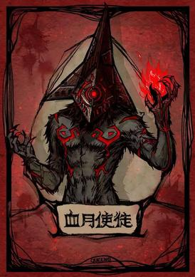

#### 能力

血月使徒在自爆后将会直接进入黑夜，当晚所有好人的技能都将会被封印。若血月使徒是最后一个被放
逐出局的狼人，他可以存活到下一个白天天亮之后才出局。

#### Q/A

[Q]当有队友存在时，血月使徒自爆翻牌参与当晚的刀人吗?
[A]不能。

[Q]当血月使徒是最后的一个狼人，自爆翻牌还会发动技能吗?
[A]不会，最后一个狼人自爆，游戏已经结束，好人胜利。

### 噩梦之影*梦魇

#### 能力

狼人阵营，每晚在其他所有人行动之前恐惧一名玩家，使其当夜无法使用技能。若对方为狼人，则整个狼人阵营当夜无法袭击玩家。不能连续两晚恐惧同一名玩家，首夜进行恐惧时与其他狼人并不互知身份。

#### Q/A

[Q]噩梦之影可以自爆或自刀吗
[A]可以。

[Q]噩梦之影可以对自己使用技能吗?
[A]不可以。

[Q]噩梦之影可以放弃使用恐惧技能吗?
[A]可以，噩梦之影可以主动放弃使用技能，若放弃技能，则对其他玩家无影响。

[Q]噩梦之影对猎人使用技能，猎人可以开枪吗?
[A]若噩梦之影当晚对猎人使用技能，猎人当晚被狼人袭击，则第二天白天无法开枪;若噩梦之影当
晚对猎人使用技能，猎人白天被票选出局，则第二天白天可以开枪。

[Q]在双药都使用的情况下，女巫可以知道自己被噩梦之影恐惧吗?
[A]不可以。

[Q]噩梦之影可以恐惧狼队友吗
[A]不可以，但在首夜不知道身份的情况下有一定几率恐惧到狼队友。任何狼队友被恐惧都会导致整
个狼人阵营夜间无法袭击玩家。

### 狼兄

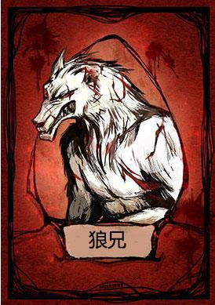

#### 能力

第一晚可以与狼弟相互认识。夜晚狼兄与其他普通狼人一起睁眼行使功能。狼兄不能自爆。

#### Q/A

[Q]狼兄怎么玩

[A]建议对跳预言家，因为出局后狼弟能获得爆刀技能

### 狼弟

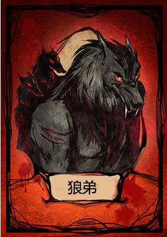

#### 能力

第一晚与狼兄相互认识。狼兄存活的情况下，夜晚该角色全程闭眼，且此时预言家查验其身份为好人。狼兄死亡的情况，狼兄死亡的下一个夜晚，如果该角色还存活，狼弟单独睁眼先袭击一个目标，随后跟随狼人一起行使功能，此时，预言家查验其身份为狼人。因此，在狼兄死亡后接下来的一个夜晚，狼人阵营可以袭击两个目标。

#### Q/A

目前狼兄死前，预言家验证存疑点，大部分是认为好人

### 种狼

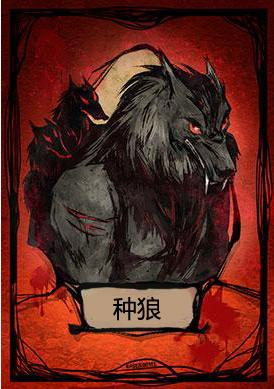

#### 能力

每天晚上醒来与其他狼人一起选择被害者，如果种狼愿意，可以发动自己的特殊能力将被害者感染为狼人，当然这种能力只有一次。若被害者被感染了，第二天早上主持人将宣布有人被感染了，而没有被害者。之后被感染的那名角色将失去他本来的技能，并且与狼人们一同出来杀人，与狼人们分享胜利。

#### Q/A

[Q] 规则

[A]可以将晚上杀掉的人变为自己的狼同伴，虽然只有一次，但是这种可以让好人-1，狼人+1的强力卡，实在是非常影响平衡，不过拥有种狼的局里一般狼数量会减少，如果大家在还没有感染的时候把种狼给杀了？那这盘游戏应该就非常轻松了。

[Q]种狼怎么玩

[A]种狼可以在看出神职牌后进行感染，但要之前保证自己不出局，不然技能就会白费，如果怕死的种狼。可以直接头一晚就使用技能。

种狼的技能如果第一晚不用就要在第二晚使用，多一个狼人，少一个好人的局势会变化很大。

### 火狼

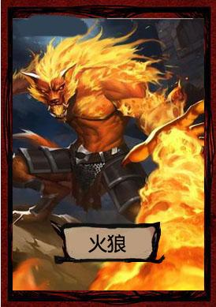

#### 能力

当有狼人死亡的时候，火狼怒气中烧，当晚可以选择一名玩家，该玩家将永久失去能力。当一天死超过一个狼人时，火狼也只可以发动一次技能，即只能让一个玩家永久失去能力。

#### Q/A

[Q]基本玩法：

[A]每次有狼人死亡，就可以发动技能，沉默神职。保护自己，在没有狼人死亡的时候可以当作普通狼人玩。

[Q]怎么玩

[A]火狼可以针对好人阵营的功能牌，只要有神跳出来，尤其是预言家，如果在牺牲狼同伴的情况下进行沉默。这样就不需要特别针对预言家了，一个没有技能的预言家就是平民，其他神职也是一样。

### 恶魔

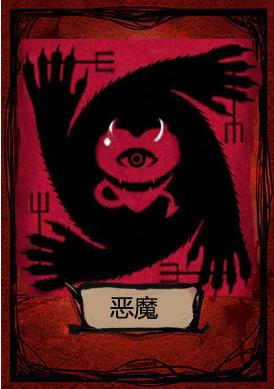

#### 能力

恶魔和狼人同一阵营，和狼人一起杀人。恶魔杀完人后，可以单独睁眼验证一名玩家是否是有技能的角色。恶魔不会在晚上死亡（也不会被晚上死亡的猎人开枪打死），但是不能自爆，自刀。

#### Q/A

[Q]怎么玩

[A]

**1、恶魔跳女巫**

恶魔不会死在夜里，意味着恶魔不怕女巫的毒药，所以悍跳女巫可以说是恶魔的基础策略。悍跳女巫可以报银水、引导局势，在一局游戏中，同时出现预言家对跳和女巫对跳，而且两组对跳中又存在千丝万缕的关联，大大地增加了好人的分析难度。

在恶魔局中，真女巫发现有人跳女巫身份，只能起身对跳，而不能像以前那样躲起来悄悄下毒。这就让女巫的身份容易过早暴露，而且真女巫没办法100%自证身份。

**2、普狼跳女巫**

在恶魔跳女巫的基础策略之上，自然会产生2阶策略——普狼跳女巫。这样做的好处是，让女巫认为自己是恶魔跳女巫，真女巫不愿意在自己身上浪费一瓶毒药，那么真女巫可能会毒到好人、另外的狼同伴或者恶魔，与1阶策略相比，晚上女巫毒死狼人的几率被降低了。

**3、女巫的自证**

首先，直接对毒是不行的。如果对跳女巫的是恶魔，真女巫要求对毒，那么晚上狼人直接杀掉真女巫，女巫毒药浪费，亏一个抢先手的轮次。而且天亮后狼人可以辩解说：对面是一个普狼跳女巫，被自己毒死了，而且他的狼队友为了污自己，故意没刀自己，blabla……

所以女巫要自证身份，应该指定一个大概率毒得死自己的毒人目标。在发言中指定一个对面女巫/预言家阵营中不太像是恶魔的玩家去毒，而且可以指定对跳的那个“女巫”去毒一个己方立场的玩家。如果本轮次两个对跳女巫的人都没有被投出局，那么天亮之后看谁的目标死了，且要分析该目标的死因是吃刀还是吃毒。

如果在对跳女巫的局面中，真女巫成功地把对面的狼人推出局，也不要高兴地太早。你以为晚上洒出毒药造成双死就能完美地自证身份了吗？不是的。因为狼人还有可能空刀。即便在对跳中推走了悍跳狼，真女巫仍需考虑如何用撒毒的目标来自证身份，这就需要结合场面上具体的形势来分析了。

**4、恶魔跳预言家+普狼跳女巫**

当一个相对固定的游戏团体达成了“有对跳女巫则必出其一”的均衡，那么狼人可以商定打出恶魔跳预言家+普狼跳女巫的策略。这种打法的好处是，即便己方跳女巫的狼人被投出局，晚上真女巫也毒不死跳预言家的恶魔。

**5、恶魔的验人策略**

由于这个版本的恶魔晚上是跟狼同伴一起睁眼的，所以不可能直接在第一夜告知他所有的神民是谁，于是节目组把恶魔的信息量变成了验人功能。

实战中恶魔的验人可以规定在狼人行动之前，也可以在狼人杀人之后。当然，先验人狼人要强很多，第一夜杀到神民的几率大大提高了。各位狼人杀爱好者可以在实战中根据自己游戏团队的实际情况来自行规定。

在杀人之前验人，那么狼团队睁眼环节直接比划给狼同伴即可。在杀人之后验人的话，恶魔需要在白天发言的时候将这个信息告诉狼同伴，还不能让好人听出来，这是需要一些语言技巧的。

恶魔的验人目标应该是选“中间人”，比如说在狼团队眼中，A玩家80%是神民，B玩家70%是平民，C玩家50/50，那么这个C玩家就应该是恶魔去验的人。

## 好人阵营

### 平民

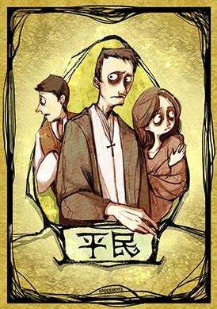

#### 能力

无特殊技能。

#### Q/A

[Q]新手拿到村民要怎么玩?
[A]认真听别人发言进行分析，自己踊跃发言不要过麦，表明自己的身份，勇于为自己心目中的预言
家投票，很快就能上手啦。

### 炸弹人

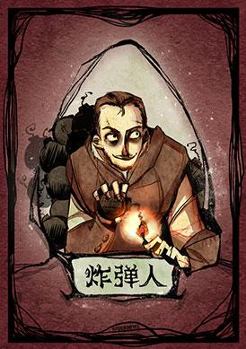

#### 能力

白天被投票放逐后，所有给他上票的玩家全部死亡，其他方式死亡无法发动技能。如果炸弹人被放逐时炸死了场上所有人，则炸弹人单独获得胜利。

#### Q/A

等有人问再说

### 预言家

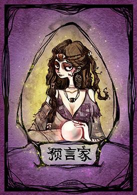

#### 能力

每天晚上可以查验一个玩家的身份，看TA是好.人还是狼人。

#### Q/A

[Q]预言家可以重复查验已经验过的目标吗?
[A]只有在有魔术师的板子中可以。

[Q]预言家可以不发动技能吗?
[A]可以，但是常不推荐。新手拿到预言家牌建议查验座位号紧挨着自己的玩家，并在轮到自己发言时第一时间报出自己的查验结果，为好人阵营提供信息。

### 女巫

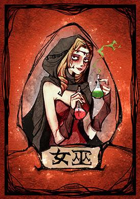

#### 能力

每晚可以选择救活一名被狼人袭击的玩家，或使用毒药使一名玩家出局。

#### Q/A

[Q]女巫能够在一夜中同时用掉毒药和解药吗?
[A]不能，女巫每晚只能选择两瓶药中的一瓶使用。

[Q]“是否允许自救” 是什么意思?
[A]在有些板子中女巫第一夜如果成为了狼人的袭击目标可以使用解药救自己，有的模式中不可以。进入房间时可以看到相关规则的说明。

[Q]女巫用掉了解药后还能看到狼人的袭击信息吗?
[A]不能，用掉解药后就看不到了。

[Q]如果屠边局中只剩下一个女巫，一个村民，一只狼人，晚上女巫毒了狼人，狼人袭击了村民或女巫，谁获胜?
[A]狼人获胜。当白天公布出局讯息后同时满足好人与狼人的胜利条件时，视为狼人获胜，该规则又被称为“狼刀在先”原则。

### 猎人

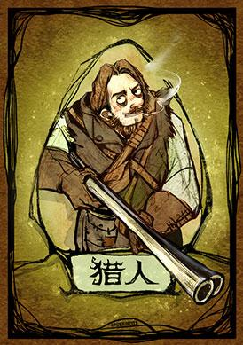

#### 能力

出局后可以选择对一名玩家开枪，使TA一并出局。

#### Q/A

[Q]如果猎人开枪带走了狼王会怎么样?
[A]玩家A是猎人，中刀或被公投出局后询问猎人是否发动技能，若选择发动技能带走了玩家B,则会询问玩家B是否发动技能。B如果是狼王且发动了技能带走了目标C后，如果玩家A能发表遗言，则按照玩家A、B、C的顺序逐一发表遗言。如果猎人不能发表遗言，则玩家B和C也都没法发表遗言。

[Q]若首夜1号、10号双出局，1号是猎人带走了8号狼王，狼王带走了5号，那么遗言顺序是怎么样的?
[A]按照1、5、8、10的顺序逐一发表遗言，即等待所有出局玩家技能发动完毕后，按照座位号从小到大的顺序之一发表遗言。
[Q]若10号猎人被放逐，带走了12号狼王，12号狼王又带走了1号，遗言顺序是怎样的?
[A] 10、 12、 1的顺序逐一发表遗言。当猎人和狼王被放逐投票出局时，被技能带走的玩家的遗言会紧跟在猎人或狼王之后。

### 白痴

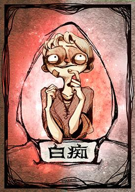

#### 能力

被放逐时翻牌公布自己的身份，以免除这次放逐的效果。技能发动后本局剩余时间不能参与放逐投票，也不能被投票。

#### Q/A

[Q]如果是白痴是警长被公投出局会怎么样?
[A]白痴会发动技能免除被放逐但接下来依然会发表遗言，移交或撕掉警徽。游戏接下来的时间内白痴角色会丧失投票权与被投票权，且无法成为移交警徽的目标。

### 守卫

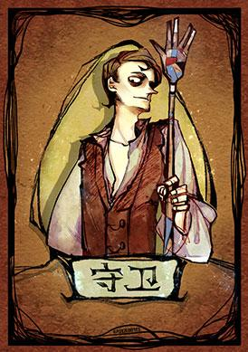

#### 能力

每晚可以守护一个玩家，防止其被狼人袭击。两晚不能连续守护相同的目标。

#### Q/A

[Q]守卫能守住女巫的毒药吗?
[A]不能。守卫的技能只对狼人的袭击有效。

[Q]如果守卫守了被女巫救了的目标会怎样?
[A]目标第二天会出局，这种情况被称为“同守同救”或“奶穿了”。

### 摄梦人*名媛

#### 能力

每晚必须选择一名玩家成为梦 游者，梦游者不知道自己正在梦游，且免疫夜间伤害。摄梦人在夜晚出局则梦游者并出局， 连续两晚成为梦游者也会出局。

#### Q/A

[Q]摄梦人能对自己使用技能吗?
[A]不能。摄梦人不能主动放弃使用技能，超时则随机从自己以外的存活玩家中选择目标发动。

[Q]女巫能看到梦游者的出局信息吗?
[A]不能，除非梦游者被狼人袭击。女巫看到的永远是狼人袭击信息。女巫对第一夜成为梦 游者的玩家用毒药也毒不出局，对第二夜成为梦游者的玩家用解药也救不活。

[Q]因梦游出局的猎人或狼王能开枪吗?
[A]不能，且猎人和狼王不知道自己是因为梦游还是女巫的毒药出局。

[Q]摄梦人首夜摄狼且被狼人袭击或被女巫毒出局，成为梦游者狼人在警.上自爆时如何处理?
[A]和吃毒狼人自爆的流程相同自爆后警徽流失但不天黑，进入放逐投票发言阶段(双爆规则下和吃毒狼人相同，会跳过白天直接入夜)

### 魔术师

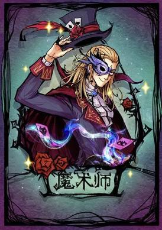

#### 能力

每晚在其他所有人之前行动，交换2个人的号码牌，当晚有效。

#### Q/A

[Q]“交换号码牌” 是什么意思?
[A]被魔术师交换号码牌的玩家当夜所有对其施放的技能目标会被互换，比如3和5被换，则狼人刀
3但中刀的是5，预言家查验3但看到的是5号的身份。

[Q]魔术师能够对自己使用技能吗?
[A]可以，但每个玩家每局游戏只能被换一次。 若所有玩家都被换过了或剩余可换玩家不足2人，则
魔术师无法使用技能。

[Q]女巫的救人信息也会被交换吗?
[A]不会。比如3和5被换，狼人刀3，则法官会告诉女巫3中刀是否要救。如果不救出局的是5。如果
女巫是3号且发生在首夜则女巫不能自救，但第二天会发现出局的是5。

### 骑士

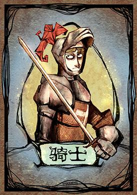

#### 能力

白天放逐发言时，可以随时翻牌，选择场上的一位玩家决斗。如果对方是狼人，则对方出局并立即进入
黑夜。如果对方好人，则骑士出局并继续白天原本的发言流程。

#### Q/A

[Q]骑士决斗好人打断发言后，被打断的玩家恢复发言时是重新计时120秒还是接着原来剩下的发言时长发言?
[A]重新计时120秒，如果是警长的话则是150秒(如果房主设置的发言时长是120秒的话)

[Q]被骑士决斗出局的狼人需要翻牌吗?
[A]不需要，法官只会公布该玩家是狼人阵营的角色，但不公布具体身份(即和预言家的技能类似)目标玩家如果是好人的时候也是类似的道理。

[Q]放逐投票平票后的发言环节骑士可以发动技能吗?
[A]不可以。

[Q]骑士如果是最后一神，决斗平民出局了，还有遗言和移交警徽的操作吗?
[A]没有，一日骑士出局游戏立刻结束(和猎人的道理类似)

### 守墓人

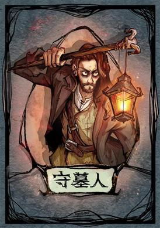

#### 能力

每晚可以得知上一个白天被放逐的玩家是好人或是狼人。

#### Q/A

Q:守墓人可以不发动技能吗?
.A: 不可以，守墓人技能的发动是强制的，每晚都会展示白天出局玩家的信息。
Q:如果白天被放逐的是石像鬼，那么夜晚守墓人查验的身份是什么?
.A:狼人。

### 乌鸦

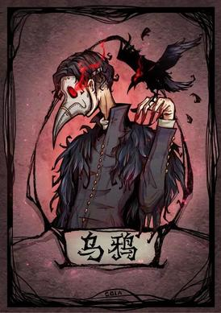

#### 能力

每晚可以暗中诅咒一名玩家，该玩家在下一个白天放逐时额外被投一票。不能连续两晚诅咒同一玩家。

#### Q/A

.Q:乌鸦能否不发动技能?
.A:可以

Q:乌鸦能否对自己使用技能?
.A:可以

Q:乌鸦的技能在.上警投票阶段是否有效?
.A:无效，只在放逐投票阶段有效

.Q:乌鸦的技能在平票pk阶段是否有效?
.A:有效

### 猎魔人

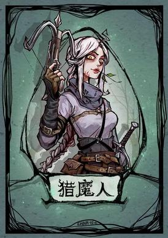

#### 能力

从第二晚开始，每晚都可以选择一名玩家进行狩猎。如果对方是狼人，则次日对方出局;如果对方是好人，则次日猎魔人出局。女巫的毒药对猎魔人无效。

#### Q/A

[Q]猎魔人能否放弃发动技能?
[A]可以。

[Q]猎魔人能否对自己使用技能
[A]不能。

[Q]猎魔人可以分辨狩猎出局的狼人是不是血月使徒吗?
[A]不能。

### 黑市商人

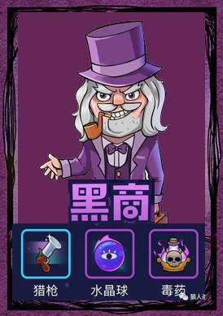

#### 能力

黑市商人可以选择三种礼物（预言家的验，女巫的毒，猎人的枪）中的一个给到一名玩家，在整局游戏中，只能使用一次，且线下狼人杀中，我们是规定的第一晚将礼物给出去。如果给到的这名玩家是好人，则该名玩家为幸运儿且获得该技能；如果给到的这名玩家属于狼人阵营，则该玩家无法获得该技能，且黑市商人死亡。值得注意的是：黑市商人所选择的任意一个技能是独立的，并不会影响对应角色的技能。

#### Q/A

有人问再说

### 狐狸

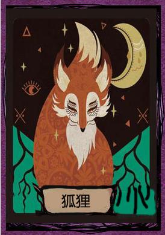

#### 能力

每晚狐狸会醒来，选择三个并排坐的人，主持人会告诉狐狸其中是否有狼人。若没有，则狐狸放松了警惕而永久失去它的能力。

#### Q/A

[Q]狐狸验人技巧

[A]去验自己或者身边的两个人其中一个。这样你的验人在你身边，如果上帝提示是有狼的，你看清自己是狐狸，狼的范围就缩小在了，剩下的两个人里面，去PK。如果上帝提示都是好人，如果你身边的这两个人不是神职的话，那么好人赢的几率很大。

[Q]狐狸警徽流

[A]如果狐狸第二夜还可以验人，那么同样可以用警徽的传递来告诉大家自己的验人结果。比如验8号，7、8、9都是好人，就给8号；7、8、9有狼人，就外置位飞警徽或者撕掉。

[Q]第二夜验人思路

[A]（1）尽量照着好人堆去验。如果能验出明确的3个好人，就有明确的逻辑基础可以去分析了。哪怕验出的好人已经死了，仍然可以对场上的形势做一个准确的判断；甚至可以通过回忆他“生前”的发言来重新分析局势。

（2）验夹缝位置，以求获得明确的验人结果。比如：坐实身份的女巫和已经翻枪的猎人尸体之间夹了一个X身份，那么晚上狐狸去验X，一定可以明确的知道X是好人还是坏人。

### 锈剑骑士

#### 能力

当锈剑骑士被狼人杀害的回合，锈剑骑士左边的第一个狼人因为锈剑导致伤口感染，只能苟且偷生一天，当锈剑骑士宣布死亡的下一个早晨，该狼人因伤口感染而病逝。

#### Q/A

[Q]基本玩法

[A]当锈剑骑士死亡后的第二天，会有两个人进行死亡，这样玩家就知道知道谁是锈剑骑士，和狼人位置，对应发言看清局势。

[Q]锈剑骑士怎么玩

[A]锈剑骑士可以开局直接跳，防止其他狼人悍跳，在发言时要有底气，因为自己死亡可以自然带走一个狼人，所以也别怕死，一换一也不亏。在看清局势下，可以选择让玩家将自己投出局，再选择骑士右边的狼人进行针对，这样就可以同时2狼出局。

### 禁言长老

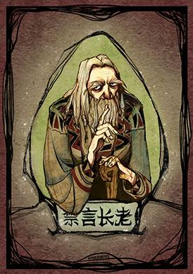

#### 能力

每天晚上可以指定一名玩家，第二天早上该玩家不能说话（但仍可以用动作表达想法）。

#### Q/A

[Q]基本玩法

[A]用于狼人杀面杀，可以在每回合禁止一位玩家说话，玩家只可以用肢体语言来表达自己的想法。禁言长老作为一张神卡，这种能力可以在关键的时刻，禁言自己所判断出的狼，从而投掉它，也可以用来自证身份，是一张面杀时非常实用的牌。

[Q]怎么玩

[A]禁言长老是一个比较带有情绪的身份牌，可以指认自己看不惯的玩家进行禁言，最好的禁言对象是狼人，如果怕会玩的玩家带节奏也可以直接禁言。

### 老流氓

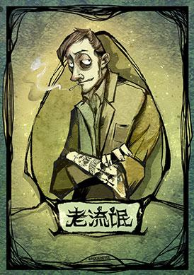

#### 能力

老流氓是平民牌，不被魅惑。在被撒毒或者射杀后分别进入中毒和负伤状态，当天不会死亡，在第二天发言结束后死亡。

#### Q/A 

### 寻熊师

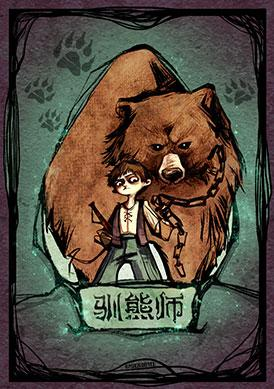

#### 能力

每天早上，当公布了被害人后，若驯熊师身边有狼人，则主持人要模仿熊吼叫。如果驯熊师被种狼感染了，那熊每天都会吼叫。

#### Q/A 

[Q]基本玩法：

[A]熊是一个类似于先知的角色，但是熊是被动的验人，熊的被动验人是法官在天亮了之后第一时间给出，根据情况不同，法官给出的信息有以下几种：

​	1、法官宣布：熊咆哮了。

​	当熊相邻的左右两边的玩家中有狼人存在时，游戏夜晚环节度过之后，大家睁眼后的第一时间，法官会	说：熊咆哮了。熊咆哮了就代表着熊的左右两边有狼人，但是熊的左右两边谁是狼，或者有一个狼还是	两个狼，熊是不知道的。

​	2、法官宣布：熊不咆哮。

​	当熊相邻的左右两边的玩家中有没有狼人的时候，游戏夜晚环节度过之后，大家睁眼后的第一时间，法	官会说：熊不咆哮。代表熊左右两边没有狼人。

​	注：只要熊在场，那么每天法官都需要宣布熊咆哮或者不咆哮。

​	3、法官宣布：熊不再咆哮。

​	当熊死亡时，法官会宣布：熊不再咆哮。如果熊是被大家投票死亡，那么熊出局死亡的时候法官不会宣	布任何信息，当第二天白天睁眼的时候，法官会宣布：熊不再咆哮。

​	4、法官宣布：熊被火烧伤，不再咆哮。这种情况只会出现在有火狼存在的时候，火狼在有狼人出局的	时候，发动技能点掉熊，那么法官会宣布：熊被火烧伤，不再咆哮。

​	注：当熊死亡或者被火狼废掉验人技能后，法官在依情况宣布完熊不再咆哮之后，每天白天刚睁眼的时	候，法官不再宣布熊的信息。

[Q]驯熊人怎么玩

[A]1、如果熊被种狼复活，那么从复活的那一刻开始，每天法官宣布的都是熊咆哮了，如果游戏中发现熊	每天都咆哮，那么大家就要考虑到熊是被种狼复活了，可以考虑把熊票出局。

​	2、如果熊被狼人夜晚杀死，那么当天法官只宣布：熊不再咆哮，不能给出熊的验人信息。例如，熊第	一天就被狼人杀死，那么首天白天睁眼的时候，法官只宣布熊不再咆哮。

​	胜利条件：如果没有被种狼复活，那么熊的胜利条件与平民阵营相同；如果熊被种狼复活，那么熊的获	胜条件与狼人相同。

[Q]玩法思路

[A]在进行有熊在场的游戏时，狼人一般从自己左右两边的人里杀人，因为如果熊咆哮了，坐在熊左右两边的狼人是很尴尬的。熊是一个不需要藏的身份，他可以说是一个可以自证的先知，因为他出局后法官会宣布熊不再咆哮，所以熊在第一天就应该跳出来，给大家逻辑，按照位置去找狼人。

[Q]基本逻辑

[A]熊叫了，则熊身边2个人至少有一个是狼人，或者熊本身变为狼人（种狼感染，这种情况本文暂不讨论）。熊没叫，则熊和他身边的2个人都是好人。

从最大信息量原则来看，好人阵营应该是更希望看到第一天熊没叫的情况。这样的话，相当于狼人杀一代中第一夜预言家验出了2个金水。仅从第一天的效果来看，一只没叫的熊给好人阵营带来的收益是大于预言家的——狼人的生存空间被缩减了3个位置。

但是随着游戏的发展，熊的验人能力是急速衰减的。一方面，熊的验人仅局限在自己身边而无法去验证其他远离自己的玩家；另一方面，熊无法利用警徽流来传达验人信息。从这两方面来看，熊在游戏中后期的威力是比不上预言家的。

推论1：**熊还活在场上时，狼人不会优先去杀死熊身边的金水——当然好人们也不可能主动去票、毒、带金水——因为这样做会把下一个顺位的人推到熊身边，相当于熊多验了一个人的身份，这是狼人所不愿意看到的。所以熊对于坐在他身边的金水，还有一定的庇护作用。

再来看一下熊叫了的情况

熊叫，对于好人来说是一个不确切信息。说明熊的身边有1个狼或者2个狼，让熊身边的两个人PK是好人阵营理所当然的做法，也可能是唯一的做法。那么PK之后呢？如果一个人被PK下去之后，熊不叫了，那说明被PK下去的人是狼人，且他的下一位是好人——这是对好人最有利的情况。

但是很多时候，一个人被PK下台之后，熊仍然叫，那么好人的信息仍是不确定的：

1. 如果被PK下去的那个人是好人，那么：

   1.1 PK获胜的那个人是狼人；

   1.2 被PK下去的人隔壁是狼人；

   1.3 上述2个都是狼人。

2. 如果被PK下去的那个人是狼人，那么：

   2.1 PK获胜的那个人也是狼人（双狼）；

   2.2 被PK下去的人隔壁是狼人（连狼）；

   2.3 上述2个都是狼人。

   

### 潜行者

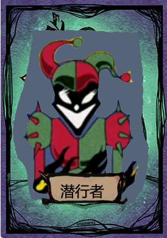

#### 能力

在白天放逐投票后，若潜行者所投的玩家没有被放逐出局，潜行者可以在当晚将其暗杀，该技能全场游戏只能发动一次。

#### Q/A

[Q]具体说明

[A]技能只能发动一次，就算潜行者投票的人只有一票也可以在夜晚直接刀，如果跟狼人的刀的目标一样，就不会被发现身份。

[Q]怎么玩

[A]有潜行者在的场次，是有很多玩家关注你的投票情况的，尽量不要让自己处于单票的情况，不然你投的人如果当晚出局，很容易被人指认为潜行者。

最好和平民一起投人，看机会要不要进行追刀，在3人以上的投票情况下可以进行夜晚追刀。

## 第三方阵营

### 丘比特

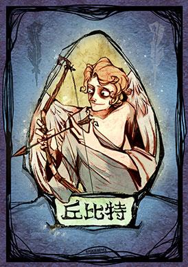

#### 能力

首夜在狼人行动前，选择任意两名玩家成为情侣。若情侣双方都为好人，则丘比特与好人胜利条件相同;若情侣双方都为狼人，则丘比特与狼人胜利条件相同;若情侣双方分别为好人和狼人，则丘比特与情侣成为第三方阵营，胜利条件为所有其他玩家出局。

#### Q/A

[Q]丘比特算神民牌吗?
[A]丘比特既不算神民牌，也不算民牌，也不算狼人牌，但被预言家查验为好人。丘比特也无法获得神民通用称号。

[Q]丘比特的胜利条件是什么?
[A]丘比特的胜利条件永远与情侣相同。若丘比特连了两个好人或连了自己和好人，则胜利条件和好人相同。若连了两个狼人，则胜利条件和狼人相同。若丘比特连了一个狼人和一个好人或连了自己和狼人，则丘比特和情侣变为第三方阵营，胜利条件变为消灭其他所有玩家。

[Q]那丘比特存在时好人和狼人的胜利条件呢?

[A]如果情侣没形成第三方阵营，好人和狼人的胜利条件和原来一样;如果情侣形成了第三方阵营，好人和狼人在原来的胜利条件基础上还要加.上放逐或击杀情侣，但不需要放逐或击杀丘比特。

[Q]丘比特可以不发动技能吗?
[A]不可以。若不操作超时则随机选择两个目标。

[Q]因殉情出局的猎人或狼王可以发动技能吗?
[A]不可以。若玩家A和B为情侣，A为猎人，则A中刀或被放逐可以开枪;若B中刀或被放逐导致A因殉情出局则不可以开枪。

[Q]若A和B为情侣，A为狼人，A自爆后B是否有遗言?
[A]有，遗言时长等于标准发言时长。

[Q]成为人狼链的角色还能获得原本的称号吗?
[A]不能，成为人狼链的角色都无法获得该身份原本应该获得的称号。

### 盗贼

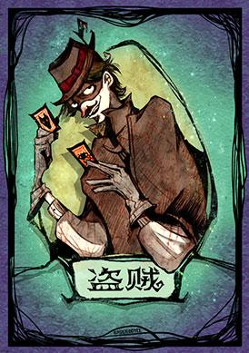

#### 能力

首夜先于所有其他人行动，从两张身份牌中选择一张作为 身份牌进行游戏。若出现狼人牌，必须选择狼
人牌。

#### Q/A

[Q]如果两张身份牌中出现了狼人，我可以不选择吗?
[A]不可以，若出现了狼人阵营的身份牌则只能选择狼人阵营的牌，即盗贼丘比特板子在游戏开始的时
候场上一定有2个狼人1个狼王。

### 咒狐

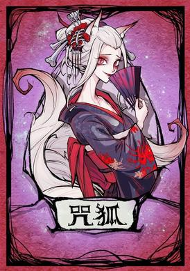

#### 能力

咒狐属于第三方阵营，被狼人袭击不会出局，若被预言家查验则会出局。当狼人或好人达到胜利条件时，
若咒狐仍然存活在场上，则咒狐取代其成为真正的胜利者。

#### Q/A

[Q]在同一夜里，如果民、神、狼某一阵营全部出局(例如:狼人袭击最后一民、女巫毒了最后一狼等)，同时咒狐出局(例如:女巫毒了咒狐、预言家查验咒狐)，算谁获胜?
[A]咒狐获胜。统一依照咒狐出局在后原则(与复盘展示顺序无关)某阵营出局的时候咒狐尚且存活，此时咒狐已经达成胜利条件。

[Q]咒狐是否算神?
[A]咒狐既不是神也不是民更不是狼，算作独立第三方。

[Q]狼人选择袭击咒狐，女巫对咒狐使用解药会怎么样?
[A]咒狐存活，解药被浪费。

[Q]好人能否区分在夜里被预言家查验出局的咒狐和其他在夜晚出局的玩家?
[A]无法区分，被预言家查验的咒狐与被女巫毒的玩家、被狼人袭击的玩家在天亮时公布的出局信息
里一起被公示。

### 暗恋者

#### 能力

暗恋者在第一夜开始时最先选择一名玩家成为自己的暗恋对象，获胜条件与暗恋对象一致，暗恋者不知
道暗恋对象的身份，暗恋对象也不知道自己被暗恋。

#### Q/A

[Q]暗恋者能否不选择暗恋对象?
[A]不能，超时未选择系统会随机选择一名暗恋对象。

[Q]暗恋者能否选择自己为暗恋对象?
[A]不能。

[Q]暗恋对象是狼人，狼全部出局，是否还能凭自己获胜?
[A]不能，狼全部出局则游戏结束，狼人失败，暗恋者同样失败。

[Q]暗恋对象是狼人，狼人屠民获胜是否只需要屠3民?
[A]不是，暗恋者无论暗恋谁都算民，狼人想要屠民获胜，暗恋者必须出局。

[Q]暗恋对象是狼人，预言家查验暗恋者是否也为狼人?
[A]不是，任何情况下预言家查验暗恋者都是好人。

### 鬼魂新娘

#### 能力

鬼魂新娘在第一晚睁眼以后，可以选择一个人成为自己的新郎，而且每天晚上睁眼可以与对方相互交流，第一晚情侣还可以选择一名玩家作为自己的证婚人变为第三阵营。

#### Q/A

有人问再说吧

### 野孩子

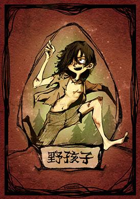

#### 能力

第一天晚上，野孩子醒来并选择一个榜样，之后的游戏中当榜样以任何形式死亡时，野孩子因为榜样的死亡而丧失人性，成为一个狼人。从这时开始野孩子成为狼人阵营，每天晚上和狼人一起行动，胜利目标也和狼人相同。

#### Q/A

[Q]野孩子判断规则

1、只有当自己的榜样死了（不管以什么方式死的），野孩子才变成狼人（晚上和狼人一起睁眼杀人），否则野孩子一直属于好人阵营  　

2、看熊孩子自己，想上狼车就跳先知，给主人丢查杀！只有主人被票出，才变狼，被杀，被毒，被咒，被带等等，都不会变狼！

[Q]野孩子怎么玩

[A]你想帮好人，勇于说出自己的榜样，觉得他是狼就让女巫毒。想帮狼，就脏自己的榜样，白天把他推了。哪怕是狼也不亏。

野孩子的选择性较大，可以临阵倒戈，由于不知道自己的榜样是好人还是狼人，所以帮助狼人获胜的几率较大。

# 板子

## 12人预女猎白 	

配置:[预言家](#预言家)，[女巫](#女巫)，[猎人](#猎人)，[白痴](#白痴)，[平民](#平民)×4，[狼人](#狼人)×4

## 12人暗恋者 	

配置:[预言家](#预言家)，[女巫](#女巫)，[猎人](#猎人)，[守卫](#守卫)，[平民](#平民)×3，[暗恋者](#暗恋者)，[狼人](#狼人)×4

## 12人白狼王骑士 

配置:[预言家](#预言家)，[女巫](#女巫)，[猎人](#猎人)，[骑士](#骑士)，[平民](#平民)×4，[白狼王](#白狼王)，[狼人](#狼人)×3

## 12人白狼王守卫 

配置:[预言家](#预言家)，[女巫](#女巫)，[猎人](#猎人)，[守卫](#守卫)，[平民](#平民)×4，[白狼王](#白狼王)，[狼人](#狼人)×3

## 12人恶灵骑士    

 配置:[预言家](#预言家)，[女巫](#女巫)，[猎人](#猎人)，[守卫](#守卫)，[平民](#平民)×4，[恶灵骑士](#恶灵骑士)，[狼人](#狼人)×3

## 12人噩梦之影 

配置:[预言家](#预言家)，[女巫](#女巫)，[猎人](#猎人)，[摄梦人](#摄梦人)，[平民](#平民)×4，[噩梦之影](#噩梦之影)，[狼人](#狼人)×3

## 12人鬼魂新娘 

配置:[预言家](#预言家)，[女巫](#女巫)，[猎人](#猎人)，[守卫](#守卫)，[平民](#平民)×4，[鬼魂新娘](#鬼魂新娘)，[狼人](#狼人)×3

## 12人黑市商人狼兄狼弟

配置:[预言家](#预言家)，[女巫](#女巫)，[猎人](#猎人)，[黑市商人](#黑市商人)，[平民](#平民)×4，[狼兄](#狼兄)，[狼弟](#狼弟)，[狼人](#狼人)×2

## 12人狼美人骑士

配置:[预言家](#预言家)，[女巫](#女巫)，[猎人](#猎人)，[骑士](#骑士)，[平民](#平民)×4，[狼美人](#狼美人)，[狼人](#狼人)×3

## 12人狼王狐女猎守

配置:狐狸，[女巫](#女巫)，[猎人](#猎人)，[守卫](#守卫)，[平民](#平民)×4，[狼王](#狼王)，[狼人](#狼人)×3

## 12人狼王魔术师 

配置:[预言家](#预言家)，[女巫](#女巫)，[猎人](#猎人)，[魔术师](#魔术师)，[平民](#平民)×4，[狼王](#狼王)，[狼人](#狼人)×3

## 12人狼王摄梦人

配置:[预言家](#预言家)，[女巫](#女巫)，[猎人](#猎人)，[摄梦人](#摄梦人)，[平民](#平民)×4，[狼王](#狼王)，[狼人](#狼人)×3

## 12人狼王守卫

配置:[预言家](#预言家)，[女巫](#女巫)，[猎人](#猎人)，[守卫](#守卫)，[平民](#平民)×4，[狼王](#狼王)，[狼人](#狼人)×3

## 12人丘比特

配置:[预言家](#预言家)，[女巫](#女巫)，[猎人](#猎人)，[白痴](#白痴)，[平民](#平民)×5，[狼王](#狼王)，[狼人](#狼人)×2，[丘比特](#丘比特)，[盗贼](#盗贼)

## 12人石像鬼守墓人

配置:[预言家](#预言家)，[女巫](#女巫)，[猎人](#猎人)，[守墓人](#守墓人)，[平民](#平民)×4，[石像鬼](#石像鬼)，[狼人](#狼人)×3

## 12人咒狐乌鸦 

配置:[预言家](#预言家)，[女巫](#女巫)，[猎人](#猎人)，[乌鸦](#乌鸦)，[平民](#平民)×4，[狼王](#狼王)，[狼人](#狼人)×2，[咒狐](#咒狐)

## 12人血月猎魔人

配置:[预言家](#预言家)，[女巫](#女巫)，[猎人](#猎人)，[猎魔人](#猎魔人)，[平民](#平民)×4，[血月使徒](#血月使徒)，[狼人](#狼人)×3

## 12人禁言潜行

配置:[预言家](#预言家)，[女巫](#女巫)，[禁言长老](#禁言长老)，[潜行者](#潜行者)，[平民](#平民)×4，[狼人](#狼人)×4

## 12人禁言骑士

配置:[预言家](#预言家)，[女巫](#女巫)，[禁言长老](#禁言长老)，[骑士](#骑士)，[平民](#平民)×4，[狼人](#狼人)×4

## 12人恶魔守卫

配置:[预言家](#预言家)，[女巫](#女巫)，[猎人](#猎人)，[恶魔](#恶魔)，[平民](#平民)×4，[狼王](#狼王)，[狼人](#狼人)×3

## 12人噩梦之影(梦魇)守卫 

配置:[预言家](#预言家)，[女巫](#女巫)，[猎人](#猎人)，[守卫](#守卫)，[平民](#平民)×4，[噩梦之影(梦魇)](#噩梦之影(梦魇))，[狼人](#狼人)×3

## 12人狼美人老流氓

配置:[预言家](#预言家)，[女巫](#女巫)，[猎人](#猎人)，[老流氓](#老流氓)，[平民](#平民)×4，[狼美人](#狼美人)，[狼人](#狼人)×3

该板子中的狼美人相对于狼美人守卫板子中的狼美人有所削弱，吃毒时无法发动技能。

# 术语

## 金水

自称自己是预言家的玩家，说经过自己的查验,另一名玩家的身份是好人，这名被“查验” 的好人玩家被称为“金水”

例:我是一个预言家，我昨天验了1号玩家，是一个金水

## 银水

女巫用解药救起的晚上被狼人击杀的玩家，这个人被称为银水

例:我是女巫，昨天晚.上1号玩家被刀了，我用解药
救了他，他是我的银水

## 铜水

守卫守护了狼人晚上击杀的玩家，该玩家被称为铜水

例:我是守卫，今天平安夜，昨天晚上我守的1号，昨天平安夜，应该是守对了，1号是我的铜水

## 查杀

自称自己是预言家的玩家，说经过自己的查验，另一名玩家的身份是狼人

例:我是一个预言家，我昨天验了1号玩家，是一个查杀

## 对跳

有两名或两名以.上的玩家声称自己是某一相同的特殊身份牌的情况，称之为对跳

例:我是女巫，前面的2号敢和我对跳女巫，我今天晚_上去把他毒死

## 悍跳

一般指狼人比较强悍地假认自己为其他某种身份牌，从而达到混淆大众视听的目的，较多见的为假认预言家

例:我才是真预言家，前面的1号应该是和我悍跳的狼人

## 悍跳狼

冒充神民的狼人，一般较多指假冒预言家的狼人

例: 1号和4号对跳预言家，我认为4号玩家是一个悍跳狼，1号玩家才是真预言家

## 站边

通常指游戏里有两个人对跳时，选择相信其中一方的行为
例: 1号和4号对跳预言家，我觉得4号狼面比较大，我这一轮站边1号

## 聊爆

狼人在发言中暴露了自己的身份

例: 5号玩家昨天的发言就已经聊爆了，一定是一个狼人，今天我们先把他出了

## 铁狼

确定无疑的狼人
例:场上两个预言家都查杀7号玩家，毫无疑问7号玩家是一个铁狼

## 自爆

狼人的玩家在白天其他人发言时可以自爆，自爆后该玩家出局，发表遗言后，跳过该白天剩余的流程，直
接进入夜晚
例: 1号跳预言家查杀2号，2号就自爆了，晚上1号就被刀了，所以1号应该是一个真预言家

## 踩

玩家在发言时，指出某名玩家发言不好的地方，这种行为叫做踩

例:你发言的时候踩我是一个狼人，我这里是一个猎人，你给我出局

## 表水

玩家发言的时候，把自己的逻辑和行为原因表达清楚尽力说清自己的身份去洗脱嫌疑的行为
例:如果说预言家验了2是一个好人的话，那么剩下的3,7两张牌里就出最后一狼了，你们两个好好表水
吧

## 蛋牌

平民
例:我这里没有什么身份，就是一张蛋牌

## 枪牌

猎人
例:我这里是一张枪牌，谁踩我谁出局

## 划水

玩家在发言中没有提供任何有价值的信息，也没有输出任何有价值的观点
例: 7号玩家已经连续划水两天了，今天就先把他出了吧

## 归票

发言号召大家在放逐投票时投给场上某一位玩家

例:我昨天晚上验了4号玩家是-一个狼人，今天我归票4号

## 冲票

多名狼人一起协力投票给某一位玩家
例:昨天3、5、7、10四张牌一起冲票了，我认为他们就是四张狼人牌

## 压手

弃票
例:我上一轮压手是因为两个预言家我真的分不清

## 抗推

在白天的放逐投票环节放逐好人
例:第一天白天真预言家被狼人抗推了，现在局势对于好人而言有一些不利

## 空守

指守卫夜晚行动时不选择守护任何人的行为

## 自守

指守卫夜晚行动时选择守护自己的行为

## 上警

全体玩家将在第一次天亮之前投票选出警长，选择上警的玩家，成为警长竞选人并发表竞选发言。警长
一旦选出，中选玩家不可拒绝该身份。
例:我上警是为了多说两句话，顺便找找预言家

## 警上

参与警长竞选
例:警上一共有1、2、3三位玩家，我1号不是预言家，看看后面2、3两位玩家谁会跳预言家吧

## 警下

未参与警长竞选
例:警下一共有四位玩家，大概率会有狼人

## 警徽流

指有警徽的预言家针对之后的查验工作做出安排，并提前布置在自己死后警徽的流向
例:我是预言家，警徽流2、3顺验，今晚去验2，明晚去验3

## 平安夜

白天法官告知前一夜没有 玩家出局的情况

## 孤狼宣言

作为场.上最后一名狼人， 表明身份并提示咒狐仍然在
场，以换取生存的行为

## 撕警徽

1、白天放逐投票时投票给警长的行为
2、警长出局后选择不移交警徽的行为
例1:这把拿警徽的是一张狼人牌， 我们先撕警徽把他出了
例2:我是预言家，1号查杀，今晚去验2号，2号是好人警徽给他，是狼人警徽撕了

## 吞警徽

在警长竞选阶段，狼人自爆打断警长竞选使得本局游戏没有警徽
例:昨天警长竞选的时候狼人自爆吧警徽吞了，所以现在没有警徽

## 退水

玩家在竞选警长时，主动宣布退出本次警长竞选。退水玩家在本次警长竞选时失去投票权
例:我上警就是为了找预言家，等会发完言我就会退水

## 反水

一般指自称预言家的玩家A表明另一名玩家B为金水，但是B不承认A的预言家身份，从而反对A的行为叫做
反水
例: 1号给我发了金水，但是我不信他是个真预言家，这把我反水

## 冲锋狼

在真假预言家对跳中，站边狼预言家的狼人
例:刚刚2、3号玩家都跟着1号玩家投票，如果说1号玩家是悍跳狼的话，2、3就很可能是冲锋狼

## 倒钩狼

在真假预言家对跳中，站边真预言家的狼人

例: 6号玩家选我当警长却聊得很差，我怀疑他是故意来脏我身份的倒钩狼

## 怂狼局

在一局游戏中没有狼人进行悍跳预言家
例:这局游戏居然没有狼人悍跳，是-局怂狼局

## 身份作好

大概率是好人
例: 8号玩家发言很有逻辑而且心态轻松，我认为他身份作好

## 诈身份

通过某些操作试图获取别人的身份信息的行为
例: 2号玩家你在警上查杀后置位的3号玩家，可能是一个诈身份的

## 积身份

一般指神民隐藏自己的身份
例:现在狼人都在提着刀在找神，希望神都好好积身份躲刀

## 穿衣服

声称自己是某一个特殊身份
例: 3号玩家今天起来穿了女巫的衣服，但是我觉得出局了的10号玩家才是真女巫

## 递话

在发言时暗中向场上另外一部分玩家传递信息
例:我认为4号玩家是一个悍跳狼，在归票的时候给队友递了话要一起冲票

## 挡刀

一般指平民伪装自己是神民来骗狼人刀TA,偶尔指神民伪装自己是平民来骗狼人刀TA
例: 5号玩家虽然穿了我的衣服说他是女巫，但是我觉得他是- -个给我挡刀的好人

## 自刀

指狼人玩家晚上出于某些战术目的，选择击杀自己的行为
例:虽然8号玩家在夜里吃刀了，但是我认为他是一个自刀的狼人所以没有救他

## 贴脸

指情绪化发言，通常是赌咒发誓

## 丢水包

玩家在自己发言时，向自己怀疑的对象施加压力的一种行为，通常是在没听到他们发言的时候给出，目的
是为了制造矛盾、引出话题

## PK

白天投票，两名玩家或两名以上的玩家平票，进行再次发言同守同救在同一个晚.上，守卫夜晚守护的玩家与女巫救起的被狼人杀害的玩家为同一人，这名玩家仍会出局

例:我是守卫昨天守护了2号玩家但是他还是死了，可能是同守同救死的

## 盲毒

指女巫在首夜不知道任何信息的情况下，选择使用毒药毒杀某一名玩家的行为
例:我是女巫，昨晚吃刀了，盲毒了1号玩家

## 睡

摄梦人使用摄梦技能
例:我是摄梦人昨晚睡了1号，今晚准备再睡他一次把他睡死

## 连

丘比特选择情侣
例:我是丘比特，连了1号玩家和2号玩家作为情侣

## 链子

被丘比特的技能选中，成为情侣的玩家
例:我发现场.上3号4号两位玩家一直在互保，他们可能是链子

## 好人链

情侣双方都是好人

## 狼狼链

情侣双方都是狼人

## 人狼链

双方一个是好人一个是狼人的情侣的情况，又叫脏链子
例:游戏到现在还不结束，链子一定是人狼链/脏链子

## 埋

被盗贼弃掉的另外一张身份底牌